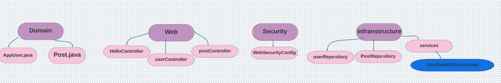

# codefellowship
## Overview
 I'll create an app called CodeFellowship that allows people learning to code to connect with each other and support each other on their coding journeys, it has basic implementation of Spring Authorization on a Java Web Application.
 
 ## Starter Guide:
To run the server application,
1. clone down this repo.

2. 'cd' into the cloned repository in your terminal

3. Make sure you have modified the applicaton.properties file with your own environment variables:

 spring.datasource.url=${DATABASE_URL}
 spring.datasource.username=${DATABASE_USERNAME}
 spring.datasource.password=${DATABASE_PASSWORD}
 spring.jpa.hibernate.ddl-auto=update
 spring.jpa.properties.hibernate.jdbc.lob.non_contextual_creation=true
 server.port=8080
 
4. Run the command:

 ./gradlew bootrun

## Routes/API
* CodefellowshipController
@GetMapping("/")
public String getCodefellowship(Principal p, Model m)
* 
* AppUserController
@PostMapping("/usercreate")
public RedirectView createUser(String username, String password, String dob, String firstname, String lastname, String bio)

* @GetMapping("/login")
 public String getLoginPage() 

* @GetMapping("/signup")
public String getSignUpPage()

* @GetMapping("/profile")
public String getMyProfilePage(Principal p, Model m)

* @GetMapping("/users/{id}")
public String getSingleAppUserPage(Model m, @PathVariable String id) 

* @GetMapping("/users")
public String getUsersPage(Principal p, Model m)

* @GetMapping("/following")
 public String getFollowingPage(Principal p, Model m) 

* @PostMapping("/follow/{id}")
public RedirectView followUser(Principal p, @PathVariable long id)
PostController

* @PostMapping("/posts")
public RedirectView createPost(Principal p, Model m, String body)

* @GetMapping("/post")
public String getPostPage() 

* @GetMapping("/feed")
public String getFeedPage(Principal p, Model m)

# Architecture /

